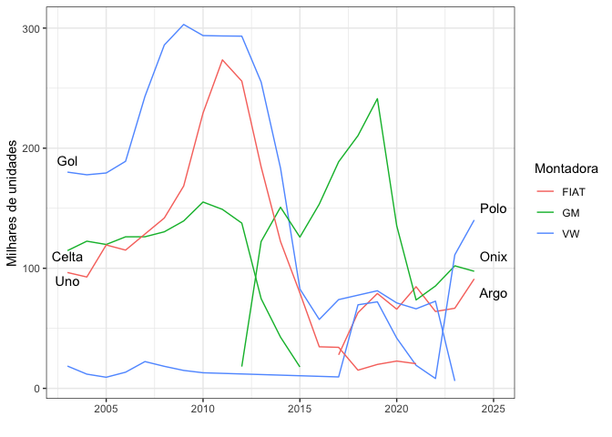

<!-- README.md is generated from README.Rmd. Please edit that file -->

# fenabrave

<!-- badges: start -->

[](https://lifecycle.r-lib.org/articles/stages.html#experimental)
<!-- badges: end -->

O objetivo desse pacote é oferecer um conjunto de dados de emplacamento
de carros no Brasil.

## Instalação

Por enquanto apenas pelo Github. Em breve no CRAN.

``` r
remotes::install_github("tomasbarcellos/fenabrave")
```

## Exemplo

Para que serve o pacote? O pacote serve para analisar dados de
emplacamento dos 50 modelos mais comuns de cada ano,

``` r
library(fenabrave)
library(ggplot2)
library(dplyr)
#> 
#> Attaching package: 'dplyr'
#> The following objects are masked from 'package:stats':
#> 
#>     filter, lag
#> The following objects are masked from 'package:base':
#> 
#>     intersect, setdiff, setequal, union

emplacamento_anual %>% 
  filter(modelo %in% c("GOL", "UNO", "CELTA",
                       "POLO", "ARGO", "ONIX"), 
         tipo == "veiculo") %>% 
  ggplot(aes(ano, quantidade / 1000, col = montadora)) + 
  geom_line(aes(group = modelo)) + 
  annotate("text", c(2003, 2003, 2003, 2025, 2025, 2025),
           c(1.9e2, 1.1e2, 0.9e2, 1.5e2, 1.1e2, 0.8e2),
           label = c("Gol", "Celta", "Uno", "Polo", "Onix",  
                     "Argo")) + 
  labs(x = "", y = "Milhares de unidades", col = "Montadora") +
  theme_bw()
```


